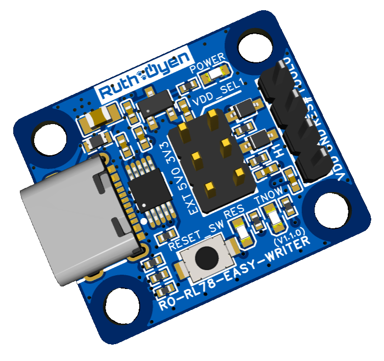

<!-- プレビュー Ctrl + Shift + V -->

# Ruth🐾Oyen パーツ紹介のページ

**ただいま工事中**
そのうち回路図とかマニュアルとかをサブページに上げます。
{width=200px}

- RL78入門3点セットを格安で販売予定。
RL78にプログラムをUSB経由で書き込むことができる基板。
ブレッドボードで使いやすくしたRL78/G12、それらを接続する治具。
[RO-RL78-EASY-WRITER](https://ruthoap.github.io/ro-rl78-easy-writer/)
RL78にプログラムをUSB経由で書き込むことができる基板。格安で販売予定。
{width=215px} {width=200px}
[RO-RL78-20PIN-DBG-CON](https://github.com/)  
RO-RL78-EASY-WRITERとRO-RL78-G12-R5F1026AASPを接続するもの。
特にブレッドボードで使う場合に配線をしなくてよい。
{width=200px}
[RO-RL78-G12-R5F1026AASP](https://github.com/)  
20ピンのRL78/G12をブレッドボードで使えるようにしたもの。
テスト用のLEDが一つ搭載されている(無効化可能)。
{width=200px}
